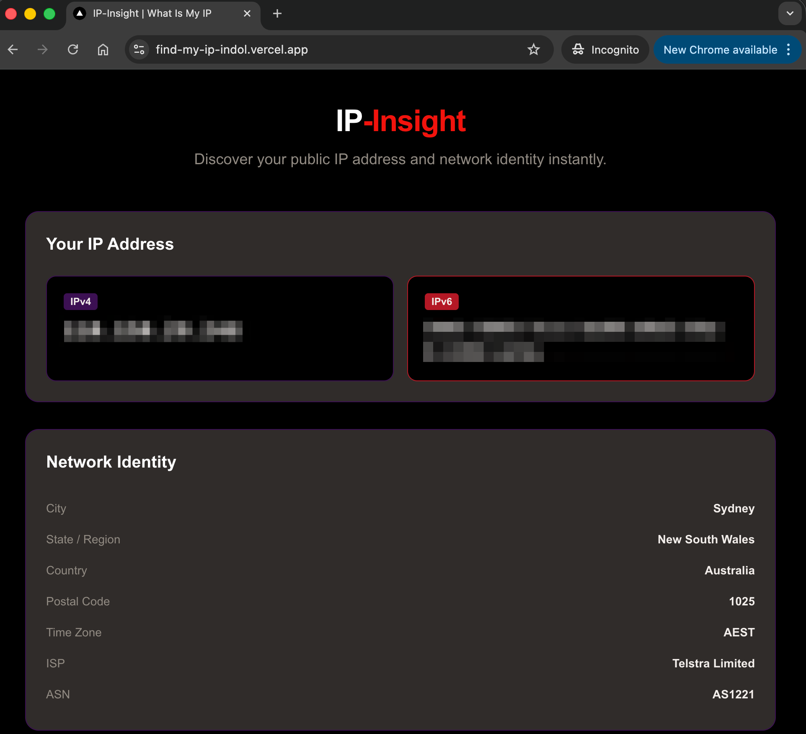

# IP-Insight

> A streamlined Next.js & TypeScript IP discovery tool managed with Bun. It features real-time IPv4/IPv6 detection, detailed geographic metadata visualization, and a built-in educational FAQ. Designed for developers and power users, it includes a robust Makefile workflow and is pre-configured for instant deployment to Vercel.

# Live Demo 

[IP-Insights](https://find-my-ip-indol.vercel.app/)

# Screenshot 



---

## Features

- 🌐 **Dual-Stack IP Detection** — Instantly displays your IPv4 and IPv6 addresses
- 📍 **Geographic Metadata** — City, State, Country, Postal Code, Time Zone, ISP, and ASN
- 🎓 **Educational FAQ** — Interactive accordion covering common IP questions
- 🌑 **Dark Mode UI** — Clean card-based layout with a custom deep-purple colour palette
- ⚡ **Vercel-Ready** — Zero-config deployment with `make vercel`

---

## Tech Stack

| Technology    | Role                      |
|---------------|---------------------------|
| Next.js 16    | App Router framework      |
| TypeScript    | Type-safe development     |
| Tailwind CSS  | Utility-first styling     |
| Bun           | Package manager & runtime |
| Vercel        | Deployment platform       |

---

## Prerequisites

- [Bun](https://bun.sh) >= 1.0.0

```bash
curl -fsSL https://bun.sh/install | bash
```

---

## Installation

```bash
# Clone the repository
git clone https://github.com/vuhung16au/find-my-ip.git
cd find-my-ip

# Install dependencies with Bun
bun install
```

---

## Development

```bash
# Start the development server on http://localhost:3000
make run
# or directly:
bun dev
```

---

## Build

```bash
# Build for production
make build
# or directly:
bun run build
```

---

## Deployment to Vercel

Install the Vercel CLI first (if not already installed):

```bash
bun add -g vercel
```

Then deploy:

```bash
make vercel
# or directly:
vercel --prod
```

---

## Project Structure

```
find-my-ip/
├── app/                    # Next.js App Router
│   ├── layout.tsx          # Root layout with metadata
│   ├── page.tsx            # Main page
│   └── globals.css         # Global styles and CSS variables
├── components/             # Reusable UI components
│   ├── IPDisplay.tsx       # IPv4/IPv6 address cards
│   ├── GeoDetails.tsx      # Network Identity card
│   └── FAQ.tsx             # Interactive FAQ accordion
├── docs/                   # Educational documentation
│   ├── ip-protocols.md     # IPv4/IPv6 protocol reference
│   └── ip-geolocation.md   # Geolocation explanation
├── public/                 # Static assets
├── Makefile                # Developer workflow targets
├── quickstart.md           # 2-minute setup guide
├── package.json
├── tsconfig.json
└── next.config.ts
```

---

## Makefile Targets

| Target        | Command              | Description                     |
|---------------|----------------------|---------------------------------|
| `make run`    | `bun dev`            | Start development server        |
| `make build`  | `bun run build`      | Build for production            |
| `make vercel` | `vercel --prod`      | Deploy to Vercel production     |

---

## Colour Palette

| Variable             | Value                  |
|----------------------|------------------------|
| `--color-purple`     | `rgb(60, 16, 83)`      |
| `--color-red`        | `rgb(242, 18, 12)`     |
| `--color-black`      | `rgb(0, 0, 0)`         |
| `--color-white`      | `rgb(255, 255, 255)`   |
| `--color-law-purple` | `rgb(181, 24, 37)`     |
| `--color-stone`      | `rgb(145, 139, 131)`   |
| `--color-charcoal`   | `rgb(48, 44, 42)`      |
| `--color-ivory`      | `rgb(242, 239, 235)`   |

---

## Documentation

- [`docs/ip-protocols.md`](docs/ip-protocols.md) — IPv4 and IPv6 protocol deep-dive
- [`docs/ip-geolocation.md`](docs/ip-geolocation.md) — How IP geolocation works
- [`quickstart.md`](quickstart.md) — 2-minute local setup guide

---

## License

MIT
